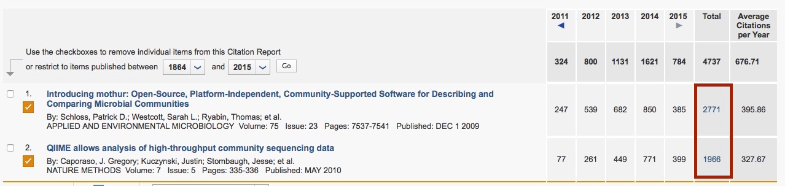
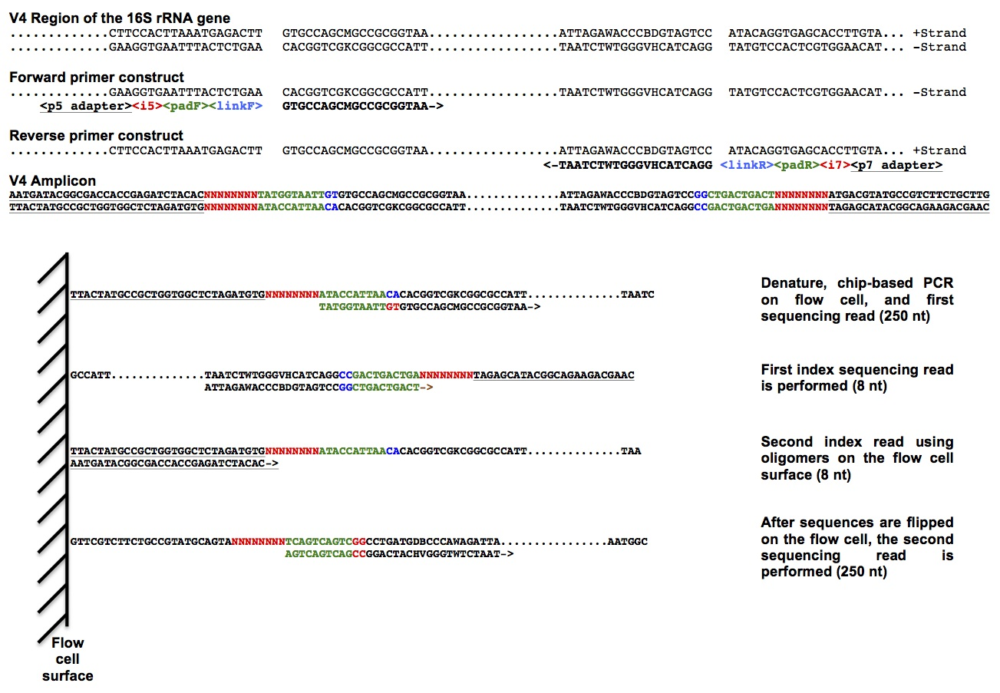

--- 
title       : mothur
subtitle    : 
date        : August 15, 2014
author      : Patrick D. Schloss, PhD (@PatSchloss)
job         : Department of Microbiology & Immunology
framework   : io2012        # {io2012, html5slides, shower, dzslides, ...}
highlighter : highlight.js  # {highlight.js, prettify, highlight}
hitheme     : tomorrow      # 
widgets     : []            # {mathjax, quiz, bootstrap}
mode        : standalone    # {selfcontained, standalone, draft}
knit        : slidify::knit2slides

--- .segue .dark

## Background 

--- &vcenter

---

## Why do I do it?
> * Started as a postdoc in Jo Handelsman's lab   
> * I have the ability to code and translate that ability to biologists - if we can develop the tools then surely others will benefit  
> * I don't like how others benchmark/validate methods
> * My lab needs software to analyze data and the tools are either poorly developed/tested or not available  

--- &vcenter

--- &twocol
## Extensive resources

*** {name: left}
* [splash page](http://www.mothur.org)
* [github repository](https://github.com/mothur/mothur)
* [analysis examples](http://www.mothur.org/wiki/Analysis_examples)
* [wiki](http://www.mothur.org/wiki)
* [forum](http://www.mothur.org/forum)
* [blog](http://blog.mothur.org)
* [mailing list](http://www.mothur.org/mailman/listinfo/mothur-announce)
* [twitter](https://twitter.com/PatSchloss)  
* [videoblog](https://www.youtube.com/user/mothurvideoblog)
* [facebook](http://www.facebook.com/mothur)

*** {name: right}

--- 
 
## Who is the typical end user? 
* Not programmers 
    * 40% have no programming background 
    * 33% know Perl 
    * 35% know R 
    * 10-20% know C/C++, Java, Python, SQL, or shell 
* Probably uncomfortable with shell
    * 48% Windows
    * 33% Mac OSX
    * 45% Linux

--- 
 
## Think of yourself, your students, or your physician...
> * How do we react to foreign jargon?
    * Cloud? 
    * Version control? 
    * Dependencies? 
    * JSON/HDFS/LNPR? 
> * Our goal is to meet the users where they are and bring them up. Not to make them feel dumb.
    * GUI
    * Examples and documentation
    * Forum
    * Workshops

--- 

## What we developed
* Stand-alone, platform-independent, open source, community supported (-ive) software package
* Builds upon popularity of DOTUR, which was published in 2005 (1473 citations; as of 8/13/14)
* The design is very PAUP*/R-ish
* We want to serve the people in coach, not the cockpit

--- &twocol 

## What does this look like?
*** {name: left}
* **Obvious** (e.g. Venn diagrams, de-convolution, heat maps)
* **De novo** (e.g. sequence trimming and filtering)
* **Derivative** (e.g. cluster, rarefaction curves, PCoA)
* **Ports of original source code** (e.g. UClust, Clearcut, CatchAll)
* **Some we re-write** (e.g. aligner, classifier, metastats, etc.)

*** {name: right}
* **Make open source** (e.g. aligner, ESPRIT)
* **Make more flexible** (e.g. classifier)
* **Add features** (e.g. ESPRIT, ChimeraSlayer)
* **Make platform independent** (e.g. sffinfo, AmpliconNoise)
* **Improve engineering** (e.g. aligner, PyroNoise)
* **Helps us to understand how things work**

--- 

## Pro/cons of strategy
* Will not serve "power users" - but they don't need us anyway
* Not always the same implementation
    * We do screw up on occasion
    * We can make things better and more accessible
* Too many options
    * This can be confusing
    *  Allow people to make bad choices

--- 

## How are we doing?

**AltMetrics:**
* 2952 mailing list recipients
* 313 wiki articles
* 915 forum members
* 7486 forum posts for 2252 topics

--- .segue .dark

## Sequencing on the MiSeq

--- 
## Preliminaries
* Platforms
    * HiSeq/GAII - tons of paired 150 nt reads (goodluck!)
    * MiSeq - 12-15x10\^6 250PE reads or 22-25x10\^6 300PE reads
* Low complexity 
    * Requires 5-10% PhiX spike in
    * Low cluster density
    * No need for staggered primers
* Need high quality data since we cannot resequence the same base more than twice

--- 

## Various approaches to sequencing 16S rRNA genes
> * Single read sequencing
> * Sequence through primer and index (Illumina's protocol)
    * Waste base calls
    * Requires two PCR steps to get adapters on (chimeras?)
> * Caporasso (EMP/AG/etc.)
    * Single index - large number of long primers
    * Generally being used with HiSeq (?)
> * Kozich/Schloss
    * Dual index - considerably fewer primers required
    * [Wet-lab SOP](http://www.mothur.org/w/images/0/0c/Wet-lab_MiSeq_SOP.pdf) available
*** =pnotes
To sequence 384 samples...
* By Caporasso you would need 384 + 1 primers
* By Kozich you would need 24 + 16 = 40 primers

---

## Which factors to consider before choosing a method?
> 1. Data quality
> 1. Number of reads
> 1. Sequence length
> 1. Cost  

---

## Importance of error rates
* Traditional genomics approach builds contigs and so errors are “solved” by increased coverage
* This is not possible for 16S rRNA sequencing
    * The sequencer can artificially generate biodiversity
    * Would like to have as fine-scale a resolution as possible
    * Additional unique sequences makes data curation/processing more challenging

--- 

## Questions
* Does a dual-index strategy work?
* Can we create a pipeline like we have for 454 that results in low error rate data?
* Is it possible to move beyond the Knight approach now that reads have gone from 150 to 250  to 300 bp to sequence longer regions?
* What are the principles of primer design so we can amplify other regions and genes?

--- bg:#FFFFFF

---  
## Dual indexing makes things easier

| # Samples | #F Primers | #R Primers | Reads/Sample*                   |
|:---------:|:----------:|:----------:|:------------------------------:|
| 96        | 12         | 8          | 156250  |
| 192       | 12         | 16         | 78125 |
| 384       | 24         | 16         | 39062 |
| 1536      | 48         | 32         | 9766|

# **\* assumes:** 15x10^6 reads per run

--- &vcenter 
## Overlapping regions within the 16S rRNA gene

--- 
## Experimental design
* Amplified V34, V4, and V45 from mock community DNA and DNA isolated from human feces, mouse feces, and soil
* All samples amplified in triplicate with different barcodes (12 total samples)
* Have used same design/samples with other sequencing platforms (454, PacBio, IonTorrent)

--- 
## Mock community
* DNA from 21 bacterial isolates with genome sequences:  
     *Acinetobacter baumannii, Actinomyces odontolyticus, Bacillus cereus, Bacteroides vulgatus, Clostridium beijerinckii, Deinococcus radiodurans, Enterococcus faecalis, Escherichia coli, Helicobacter pylori, Lactobacillus gasseri, Listeria monocytogenes, Neisseria meningitidis, Porphyromonas gingivalis, Propionibacterium acnes, Pseudomonas aeruginosa, Rhodobacter sphaeroides, Staphylococcus aureus, Staphylococcus epidermidis, Streptococcus agalactiae, Streptococcus mutans, Streptococcus pneumoniae* (Available through BEI: v3.1, HM-278D)
* Since we know the true 16S rRNA gene sequences we can measure the error rates
* Can remove chimeras *a priori*

--- 

## Basic error correction
* Trust MiSeq software to call indices
* Form contigs between read pairs and resolve mismatch based on better quality score (same score = N)
* Remove anything with…
    * Ambiguous base calls
    * Homopolymer length greater than 8
    * Doesn’t map to correct region

---

## Error profile

---

## Make contigs
* Align forward and reverse reads to each other along with their quality scores
* If there is a mismatch the base a qual score that is greater than or equal to DQthreshold wins
* If it is less than DQthreshold the base becomes an N and the read will ultimately get rejected
* Contig length must make “sense”

---
## Error rates  

  
* The V4 region yields the best error rates and retains the most reads  
* Require Q to be at least 6 points higher to break a mismatch  

--- 

## Error rate summary

| Region  | Length | Error rate after making contigs (%) | Error rate after pre.cluster (%) |
|---------|--------|-------------------------------------|----------------------------------|
| V3-V4   | 429    | 0.41                                | 0.26                             |
| V4      | 253    | 0.04                                | 0.01                             |
| V4-V5   | 375    | 0.57                                | 0.26                             |
| "V3-V5" | 260    | 0.06                                | 0.02                             

# **"V3-V5":** Based on our 454 SOP using PyroNoise

--- 

## Richness
| Sample        | V3-V4          | V4            | V4-V5            |
|---------------|----------------|---------------|------------------|
| Mock - PC(20) | NA             | 21.4          | 83.5             |
| Mock - actual | NA             | 32.4          | 126.2            |
| Mouse         | NA             | 135.7         | 145.7            |
| Human         | NA             | 121.6         | 187.8            |
| Soil          | NA             | 1271.3        | 1221.2           |
  
# All rarefied to 5,000 reads
# (XX) – number of OTUs w/ no errors
# Mock-PC has no chimeras
  
* "Richness" is correlated with sequencing depth / crap
* Error rates have a significant impact on number of observed OTUs

---

## Error rate with new chemsitry

| Region  | Length | 250PE error rate after making contigs (%) | 300PE error rate after pre.cluster (%) |
|---------|--------|-------------------------------------------|----------------------------------------|
| V3-V4   | 429    | 0.41                                      | 0.80                                   |
| V4      | 253    | 0.04                                      | 0.04                                   |
| V4-V5   | 375    | 0.57                                      | 0.90                                   |
| "V3-V5" | 260    | 0.06                                      | NA                                     |     

# **"V3-V5":** Based on our 454 SOP using PyroNoise
   

### Meh.

---

## Quality scores with the V3 chemistry

### Note that the quality scores crap out around cycle 500

---

## Concluding the MiSeq pipeline
* Sequence reads must fully overlap with each other to get good error remediation
* If they don't...
    * Inflated number of unique reads / OTUs
    * Samples will look more different than they really are
    * Significant computational hurdles await
    * Cheaper to throw data away and resquence correctly than to buy sufficient RAM/time
* The V3 MiSeq kit isn't going to cut it for longer reads

--- .segue .dark

## The rest of the pipeline

---

## The [MiSeq mothur SOP](http://www.mothur.org/wiki/MiSeq_SOP)
| method         | what it does... | reference    |
|----------------|-----------------|--------------|
| `make.contigs` | assemble reads  | [Kozich et al. 2014](http://www.ncbi.nlm.nih.gov/pubmed/23793624)
| `screen.seqs` | remove bad reads |
| `unique.seqs` | collapse duplicate reads |
| `count.seqs` | count frequency of each sequence in each sample |
| `align.seqs` | align sequences to a reference | [Schloss 2009](http://www.ncbi.nlm.nih.gov/pubmed/20011594), [Schloss 2010](http://www.ncbi.nlm.nih.gov/pubmed/20628621)
| `filter.seqs` | trim reads to same alignment space | [Schloss 2013](http://www.ncbi.nlm.nih.gov/pubmed/23018771)
| `pre.cluster` | remove one and two offs | [Schloss et al. 2011](http://www.ncbi.nlm.nih.gov/pubmed/22194782)
| `chimera.uchime` | identify and remove chimeras | [Edgar et al. 2011](http://www.ncbi.nlm.nih.gov/pubmed/21700674)
| `classify.seqs` | classify sequences against a database | [Wang et al. 2009](http://www.ncbi.nlm.nih.gov/pubmed/17586664)
| `remove.lineage` | remove contaminants | 
| `cluster.split` | assign sequences to OTUs | [Schloss & Westcott 2011](http://www.ncbi.nlm.nih.gov/pubmed/21421784)
| `phylotype` | assign sequences to phylotypes | 
| `make.shared` | generate sample by OTU frequency table | 
| `clearcut` | generate a neighbor-joining tree | [Sheneman et al. 2006](http://www.ncbi.nlm.nih.gov/pubmed/16982706)

--- &twocol w1:35% w2:55%
## Philosophy
*** {name: left}
* mothur is one tool you have for analyzing your 16S rRNA gene sequences
* We cannot envision or accomodate every analysis need that every researcher has
* You need to take the next step of learning R or python to make your analysis unique

*** {name: right}

<canvas id="unnamed_chunk_1textureCanvas" style="display: none;" width="256" height="256">
Your browser does not support the HTML5 canvas element.</canvas>
<!-- ****** spheres object 6 ****** -->

 
<!-- ****** text object 8 ****** -->

 
<!-- ****** text object 9 ****** -->

 
<!-- ****** text object 10 ****** -->

 
<!-- ****** lines object 11 ****** -->

 
<!-- ****** text object 12 ****** -->

 
<!-- ****** lines object 13 ****** -->

 
<!-- ****** text object 14 ****** -->

 
<!-- ****** lines object 15 ****** -->

 
<!-- ****** text object 16 ****** -->

 
<!-- ****** lines object 17 ****** -->

 

<canvas id="unnamed_chunk_1canvas" width="1" height="1"></canvas> 

You must enable Javascript to view this page properly.

---

## Gameplan
* Run example dataset through [MiSeq SOP](http://www.mothur.org/wiki/MiSeq_SOP) 
* Work through alpha and beta diversity analysis methods and population-level analyses
* Dataset comes from a study of C57BL/6 mice that were sampled for 6 months. Study was [originally published](http://www.ncbi.nlm.nih.gov/pubmed/22688727) in Gut Microbes
