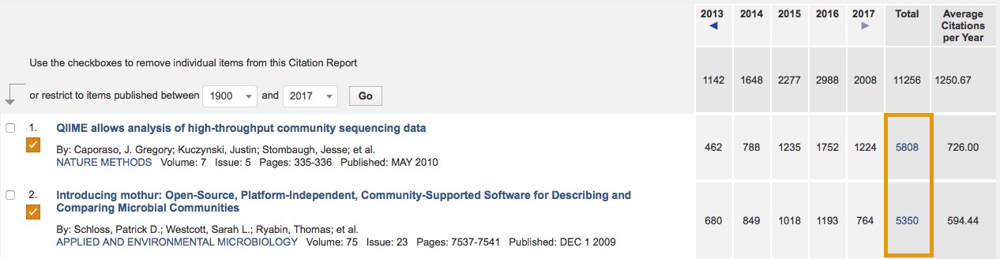
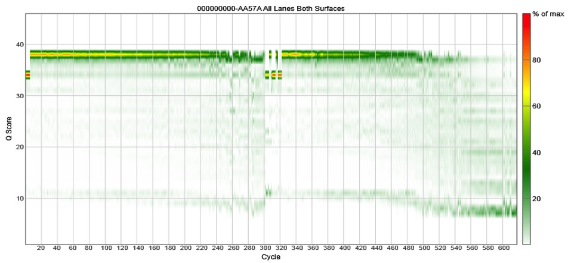

--- 
title       : Development of a 16S rRNA gene sequencing pipeline for the MiSeq
subtitle    : "http://goo.gl/KATDw8"
date        : August 27, 2014
author      : Patrick D. Schloss, PhD (@PatSchloss)
job         : Department of Microbiology & Immunology
framework   : io2012        # {io2012, html5slides, shower, dzslides, ...}
highlighter : highlight.js  # {highlight.js, prettify, highlight}
hitheme     : tomorrow      # 
widgets     : []            # {mathjax, quiz, bootstrap}
mode        : standalone    # {selfcontained, standalone, draft}
knit        : slidify::knit2slides

--- .segue .dark

## mothur 
```{r setup, results='asis', echo=FALSE, warning=FALSE}
library(rgl)
library(knitr)
knit_hooks$set(webgl = hook_webgl)
cat('<script type="text/javascript">', readLines(system.file('WebGL', 'CanvasMatrix.js', package = 'rgl')), '</script>', sep = '\n')
```

--- &vcenter


--- &twocol
## The Small Subunit rRNA genes

*** {name: left}
* Evolutionary chronometer
* Ubiquitous across all of life (16S: B/A and 18S: E)
* Highly conserved (good and bad)
* Low rates of horizontal gene transfer
* Most deposited gene into GenBank
* Conserved primers allow us to target variable regions within the gene

*** {name: right}


---
## How do we analyze 16S rRNA genes?  
> * Classification based (supervised)  
  * Limited by database, length of reads, conflicting taxonomies  
  * What value are names?
  * Sequencing errors not as critical
> * Operational taxonomic units (OTUs; unsupervised)
  * Assign sequences to OTUs based on similarity to each other
  * Computationally demanding
  * Sensitive to sequencing errors  
> * Should not have to justify the need high quality data


--- &vcenter


--- &twocol
## Extensive resources

*** {name: left}
* [splash page](http://www.mothur.org)
* [github repository](https://github.com/mothur/mothur)
* [analysis examples](http://www.mothur.org/wiki/Analysis_examples)
* [wiki](http://www.mothur.org/wiki)
* [forum](http://www.mothur.org/forum)
* [blog](http://blog.mothur.org)
* [mailing list](http://www.mothur.org/mailman/listinfo/mothur-announce)
* [twitter](https://twitter.com/PatSchloss)  
* [videoblog](https://www.youtube.com/user/mothurvideoblog)
* [facebook](http://www.facebook.com/mothur)

*** {name: right}


--- 

## What we developed
* Stand-alone, platform-independent, open source, community supported (-ive) software package
* Builds upon popularity of DOTUR, which was published in 2005 (1473 citations; as of 8/13/14)
* The design is very PAUP*/R-ish

--- 

## How are we doing?



**AltMetrics:**
* 2952 mailing list recipients
* 313 wiki articles
* 915 forum members
* 7486 forum posts for 2252 topics

--- .segue .dark

## Sequencing the 16S rRNA gene

--- 

## Which factors to consider before choosing a method?
> 1. Data quality
> 1. Number of reads
> 1. Sequence length
> 1. Cost  

--- &twocol
## This is not genome sequencing
*** {name: left}
* Traditional genomics approach builds contigs to "solve" errors
* Sequencing 16S rRNA gene has limited ability to resequence individual bases
* Sequencing variants represent novel biodiversity
* Would like to have as fine-scale a resolution as possible


*** {name: right}
```{r error, echo=FALSE}
	x <- 0:10
	e1 <- 0.01
	e2 <- 0.005
	e3 <- 0.0001
	length <- 250
	
	plot(x, dbinom(x, length, e1), type="l", ylim=c(0,0.35), xlab="Number of errors", ylab="% of 250 bp 16S rRNA gene fragments", yaxt="n", lwd=3)
	points(x, dbinom(x, length, e2), type="l", col="red", lwd=3)
	points(x, dbinom(x, length, e3), type="l", col="blue", lwd=3)
	axis(2, at=seq(0,0.35,0.05), label=seq(0,35,5), las=1)
	legend(x=8, y=0.30, legend=c("1.00%", "0.50%", "0.01%"), lwd=3, col=c("black", "red", "blue"))
```

---

## But first... sequencing with other platforms

* [**Titanium:**](http://www.plosone.org/article/info%3Adoi%2F10.1371%2Fjournal.pone.0027310) 250 bp reads with an 0.02% error rate
* [**GSFLX+:**](https://www.youtube.com/watch?v=IobnyTQ4F6Q) 600 bp reads with an 0.02% error rate
* Others...
  * **PacBio:** Full length reads, but error rates of 0.5%  
  * **IonTorrent:** Disaster - short and high error rates  

--- 

## Illumina-based approaches 
> * Single read sequencing (Ugh...)
> * Sequence through primer and index (Illumina's protocol)
    * Waste base calls
    * Requires two PCR steps to get adapters on (chimeras?)
> * [Caporasso/Knight](http://www.ncbi.nlm.nih.gov/pubmed/22402401) (EMP/AG/etc.)
    * Single index - large number of long primers
    * Generally being used with HiSeq (?)
> * [Kozich/Schloss](http://www.ncbi.nlm.nih.gov/pubmed/23793624)
    * Dual index - considerably fewer primers required
    * [Wet-lab SOP](http://www.mothur.org/w/images/0/0c/Wet-lab_MiSeq_SOP.pdf) available

--- 

## Questions
* Does a dual-index strategy work?
* Can we create a pipeline like we have for 454 that results in low error rate data?
* Is it possible to move beyond the Knight approach now that reads have gone from 150 to 250  to 300 bp to sequence longer regions?
* What are the principles of primer design so we can amplify other regions and genes?

--- bg:#FFFFFF


---  
## Dual indexing makes things easier

| # Samples | #F Primers | #R Primers | Reads/Sample*                   |
|:---------:|:----------:|:----------:|:------------------------------:|
| 96        | 12         | 8          | 156250  |
| 192       | 12         | 16         | 78125 |
| 384       | 24         | 16         | 39062 |
| 1536      | 48         | 32         | 9766|

# **\* assumes:** 15x10^6 reads per run

--- &vcenter 
## Overlapping regions within the 16S rRNA gene


--- 
## Experimental design  
* Amplified V34, V4, and V45 from mock community DNA and DNA isolated from human feces, mouse feces, and soil  
* All samples amplified in triplicate with different barcodes (12 total samples)  
* Have used same design/samples with other sequencing platforms (454, PacBio, IonTorrent)  
* Sequencing runs...  
  * Cluster density ~ 800 k/mm2
  * %PhiX ~ 5-10%  

---   
## Mock community
* DNA from 21 bacterial isolates with genome sequences:  
     *Acinetobacter baumannii, Actinomyces odontolyticus, Bacillus cereus, Bacteroides vulgatus, Clostridium beijerinckii, Deinococcus radiodurans, Enterococcus faecalis, Escherichia coli, Helicobacter pylori, Lactobacillus gasseri, Listeria monocytogenes, Neisseria meningitidis, Porphyromonas gingivalis, Propionibacterium acnes, Pseudomonas aeruginosa, Rhodobacter sphaeroides, Staphylococcus aureus, Staphylococcus epidermidis, Streptococcus agalactiae, Streptococcus mutans, Streptococcus pneumoniae* (Available through BEI: v3.1, HM-278D)
* Since we know the true 16S rRNA gene sequences we can measure the error rates
* Can remove chimeras *a priori*

---

## Error profile


--- 

## Basic error correction
> * Trust MiSeq software to call indices
> * Form contigs
  * If there is a mismatch, the base with a qual score that is greater than or equal to a threshold wins
  * If it is less than threshold the base becomes an N and the read will ultimately get rejected
  * Contig length must make “sense”
> * Remove anything with…
  * Ambiguous base calls
  * Homopolymer length greater than 8
  * Doesn’t map to correct region

---
## Error rates  

  
* The V4 region yields the best error rates and retains the most reads  
* Require Q to be at least 6 points higher to break a mismatch  

--- 

## Error rate summary

| Region  | Length | Error rate after making contigs (%) | Error rate after pre.cluster (%) |
|---------|--------|-------------------------------------|----------------------------------|
| V3-V4   | 429    | 0.41                                | 0.26                             |
| V4      | 253    | 0.04                                | 0.01                             |
| V4-V5   | 375    | 0.57                                | 0.26                             |
| "V3-V5" | 260    | 0.06                                | 0.02                             

# **"V3-V5":** Based on our 454 SOP using PyroNoise

--- 

## Richness
| Sample        | V3-V4          | V4            | V4-V5            |
|---------------|----------------|---------------|------------------|
| Mock - PC(20) | NA             | 21.4          | 83.5             |
| Mock - actual | NA             | 32.4          | 126.2            |
| Mouse         | NA             | 135.7         | 145.7            |
| Human         | NA             | 121.6         | 187.8            |
| Soil          | NA             | 1271.3        | 1221.2           |
  
# All rarefied to 5,000 reads
# (XX) – number of OTUs w/ no errors
# Mock-PC has no chimeras
  
* "Richness" is correlated with sequencing depth / crap
* Error rates have a significant impact on number of observed OTUs

---

## Error rate with new chemsitry

| Region  | Length | 250PE error rate after making contigs (%) | 300PE error rate after pre.cluster (%) |
|---------|--------|-------------------------------------------|----------------------------------------|
| V3-V4   | 429    | 0.41                                      | 0.80                                   |
| V4      | 253    | 0.04                                      | 0.04                                   |
| V4-V5   | 375    | 0.57                                      | 0.90                                   |
| "V3-V5" | 260    | 0.06                                      | NA                                     |     

# **"V3-V5":** Based on our 454 SOP using PyroNoise
   

### Meh.

---

## Quality scores with the V3 chemistry



* Note that the quality scores crap out around cycle 500
* Similar results with varying cluster density/%PhiX

---

## The [MiSeq mothur SOP](http://www.mothur.org/wiki/MiSeq_SOP)
| method         | what it does... | reference    |
|----------------|-----------------|--------------|
| `make.contigs` | assemble reads  | [Kozich et al. 2014](http://www.ncbi.nlm.nih.gov/pubmed/23793624)
| `screen.seqs` | remove bad reads |
| `unique.seqs` | collapse duplicate reads |
| `count.seqs` | count frequency of each sequence in each sample |
| `align.seqs` | align sequences to a reference | [Schloss 2009](http://www.ncbi.nlm.nih.gov/pubmed/20011594), [Schloss 2010](http://www.ncbi.nlm.nih.gov/pubmed/20628621)
| `filter.seqs` | trim reads to same alignment space | [Schloss 2013](http://www.ncbi.nlm.nih.gov/pubmed/23018771)
| `pre.cluster` | remove one and two offs | [Schloss et al. 2011](http://www.ncbi.nlm.nih.gov/pubmed/22194782)
| `chimera.uchime` | identify and remove chimeras | [Edgar et al. 2011](http://www.ncbi.nlm.nih.gov/pubmed/21700674)
| `classify.seqs` | classify sequences against a database | [Wang et al. 2009](http://www.ncbi.nlm.nih.gov/pubmed/17586664)
| `remove.lineage` | remove contaminants | 
| `cluster.split` | assign sequences to OTUs | [Schloss & Westcott 2011](http://www.ncbi.nlm.nih.gov/pubmed/21421784)
| `phylotype` | assign sequences to phylotypes | 
| `make.shared` | generate sample by OTU frequency table | 
| `clearcut` | generate a neighbor-joining tree | [Sheneman et al. 2006](http://www.ncbi.nlm.nih.gov/pubmed/16982706)

---

## Concluding the MiSeq pipeline
* Sequence reads must fully overlap with each other to get good error remediation
* If they don't...
    * Inflated number of unique reads / OTUs
    * Samples will look more different than they really are
    * Significant computational hurdles await
    * Cheaper to throw data away and resquence correctly than to buy sufficient RAM/time
* Staggered primers and high %PhiX aren't necessary
* The V3 MiSeq kit isn't going to cut it for longer reads


--- &twocol w1:35% w2:55%
## Acknowledgements
*** {name: left}
* **Schloss Lab**
 * Sarah Westcott
 * Jim Kozich
* **Sequencing centers**
 * Illumina (no $ to SchlossLab)
 * 454 (free seq. runs)
 * U of M Seq. Core
* **NIH**
 * NIH R01HG005975 
 * NIH R01GM099514  


*** {name: right}

```{r webgl=TRUE, echo=FALSE}
pcoa <- read.table(file="assets/data/stability.axes", header=T, row.names=1)
pcoa <- pcoa[,1:3]
colnames(pcoa) <- c("Axis 1", "Axis 2", "Axis 3")

period <- character()
period[as.numeric(gsub(".*D(\\d*)", "\\1", rownames(pcoa))) <= 10] <- "red"
period[as.numeric(gsub(".*D(\\d*)", "\\1", rownames(pcoa))) > 10] <- "blue"
plot3d(pcoa, size=1, type="s", col=period)

```
