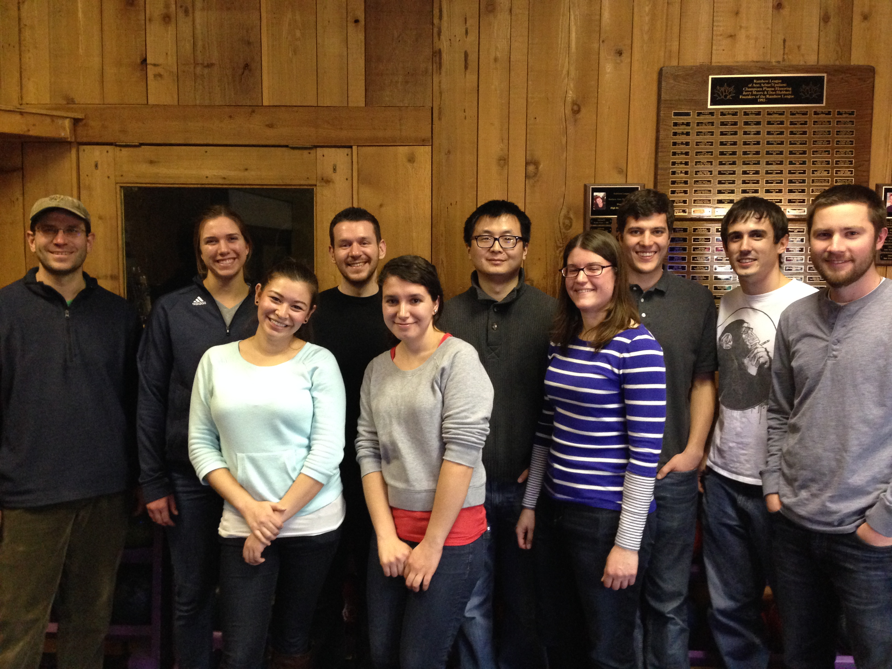
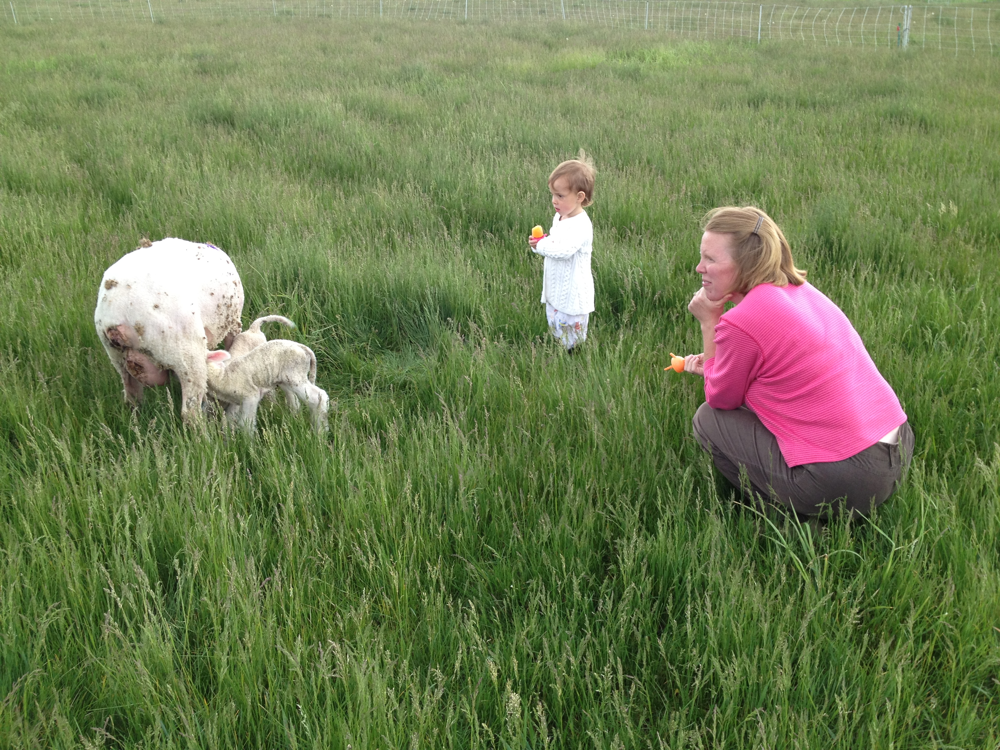
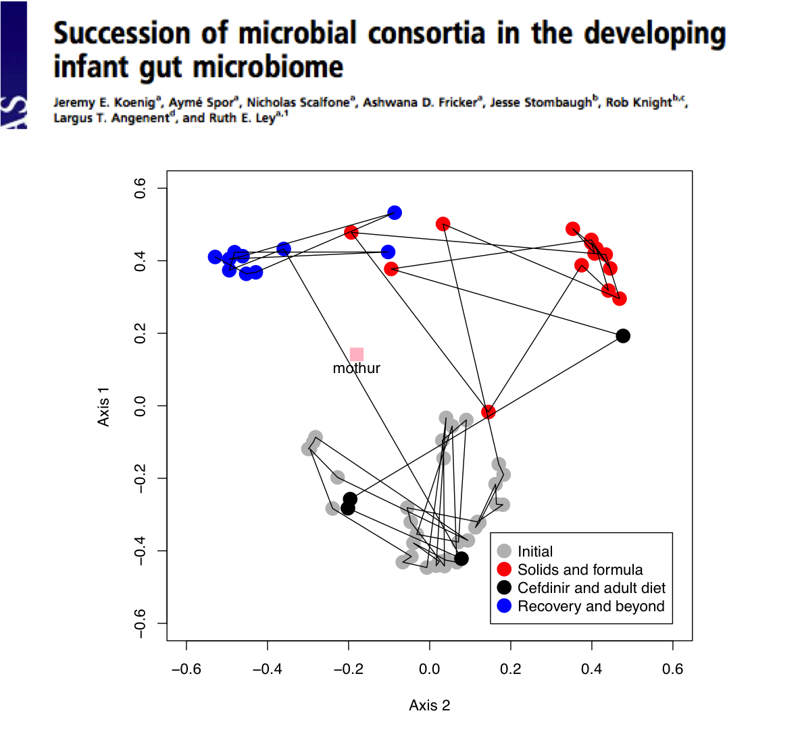

---

## We are interested in understanding...

> * the forces that shape microbial communities
> * why that variation matters

---



---

## Some questions that we have that you probably do too

> * Why do we see the diversity that we do within our communities?
> * Why are instances of these communities so different?
> * What if we could take community X from environment A and put it in
environment B?
> * What if we could take community X and start over in environment A?
> * Can we change the direction that community X takes to make it look more
like community Y?

--- &twocol

## Oh yeah - we do this in the gut

*** {name: left}


*** {name: right}
> * It contains a tractable microbial "community"
> * Non-human systems are fairly reproducible
> * Easy to perturb (antibiotics, diet)
> * Numerous phenotypes (disease models)
> * Can generate environments (genetics)
> * Can generate communities (germ-free)

---

## Why do we observe the diversity we do in the gut?

> * Genetics/Evolution
> * Diet (e.g. vegan vs. SuperSizeMe)
> * Environmental exposures (e.g. rural vs. urban)
> * Life history (e.g. breast vs. bottle fed, antibiotics)
> * Immune system
> * Very difficult to separate these forces to determine their relative
importance

---

## Shocker: Ecologists have thought about this too!

* **Neutral theory (Hubbell):** The differences between trophically similar
organisms are not important and the observed biodiversity is the product of
each species taking a random walk (e.g. Island biogeography)
* **Community assembly rules (Diamond):** Competition is the primary force that
shapes the structure of communities and populations will seek to minimize niche
overlap (e.g. Forest succession)

>* Should sound analogous to anyone familiar with the rift between the neutral
and selection-based models of molecular evolution. The truth is somewhere in the
middle

--- .segue .dark

## Experimental systems for studying the formation of host-associated communities

---

## Neonate gut


#  Palmer et al. (2007) PLoS Biology

---



--- &twocol

## Sympatric populations of *Peromyscus* spp.

***{name: left}
* Unable to differentiate between sympatric species of mice (not a novel result)
* Diet does not explain variation
* Physiological state does not explain variation
* "Personalized" signal of community is lost within a week

# Baxter et al. (2014) AEM *in review*

***{name: right}

```{r, echo=FALSE, fig.align='center', fig.height=8}

md <- read.table(file="~/Documents/Manuscripts/BaxterWildMiceManuscript/wild_mouse_knitr/wild.metadata.txt", header=T)
rownames(md) <- md$Group
nsamples <- nrow(md)
o <- order(rownames(md))
md <- md[o,]


dist <- read.table(file="~/Documents/Manuscripts/BaxterWildMiceManuscript/wild_mouse_knitr/16S.analysis/wild_mice.16S.trim.contigs.unique.good.good.filter.unique.precluster.pick.pick.an.unique_list.0.03.subsample.thetayc.0.03.square.ave.dist", skip=1, row.names=1)
rownames(dist) <- gsub("^(.*)_16S", "\\1", rownames(dist))
o <- order(rownames(dist))
dist <- dist[o,o]
stopifnot(sum(rownames(dist) != rownames(md)) == 0)	#make sure everything is in the same order
thetayc <- as.dist(dist)

pl <- numeric()
pmg <- numeric()
between <- numeric()

pl.et <- factor(md[md$SP=="PL", "ET"])
thetayc <- as.matrix(thetayc)
for(et in pl.et){
  pl[et] <- median(unlist(thetayc[md$ET==et, md$ET!=et]))
  between[et] <- median(unlist(thetayc[md$ET==et, md$SP!="PL"]))
}

pmg.et <- factor(md[md$SP=="PMG", "ET"])
for(et in pmg.et){
  pmg[et] <- median(unlist(thetayc[md$ET==et, md$ET!=et]))
  between[et] <- median(unlist(thetayc[md$ET==et, md$SP!="PMG"]))
}

par(mar=c(12, 5, 0.5, 0.5))
stripchart(at=1, pl, vertical=T, method="jitter", jitter=0.3, xlim=c(0.5,3.5), ylim=c(0,1.0), yaxt="n", pch=21, bg="white", ylab=expression(paste("Median ", theta["YC"], " distance", sep=" ")), cex.lab=2)
stripchart(at=2, pmg, vertical=T, method="jitter", jitter=0.3, add=T, pch=19, col="black")
stripchart(at=3, between, vertical=T, method="jitter", jitter=0.3, add=T, pch=19, col="gray")
axis(1, at=1:3, label=c("Among\nP. leucopis", "Among\nP. maniculatus\ngracilis", "Between\nspecies"), las=2, tick=F, cex.axis=1.8)
axis(2, las=2, cex.axis=1.8)
segments(x0=c(0.6, 1.6, 2.6), x1=c(1.4, 2.4, 3.4), y0=c(median(pl), median(pmg), median(pmg)), y1=c(median(pl), median(pmg), median(pmg)), lwd=4, lty=1)
```


---

## Sympatric populations of *Peromyscus* spp.

```{r, webgl=TRUE, echo=FALSE, fig.align='center'}
nmds <- read.table(file="~/Documents/Manuscripts/BaxterWildMiceManuscript/wild_mouse_knitr/16S.analysis/wild_mice.16S.trim.contigs.unique.good.good.filter.unique.precluster.pick.pick.an.unique_list.0.03.subsample.thetayc.0.03.square.ave.nmds.axes", header=TRUE, row.names=1)
rownames(nmds) <- gsub("^(.*)_16S", "\\1", rownames(nmds))
o <- order(rownames(nmds))
nmds <- nmds[o,]
clrs <- c("PL"="blue", "PMG"="red")
plot3d(nmds, size=1, type="s", col=clrs[md$SP], xlab="Axis 1", ylab="Axis 2", zlab="Axis 3")
```

--- &twocol

## Germ-free transplant models  

***{name: left}
* Crazy transplants
  * Zebrafish -> Mouse
  * Mouse -> Zebrafish
  * Host manipulates the community to look more like itself
* Even crazier (2014)
  * Soil -> Mouse
  * Termite -> Mouse
  * Zebrafish -> Mouse


***{name: right}


# Rawls et al. (2006) Cell 127:434

---

## Slightly less bizarre: mouse into mouse

```{r, echo=FALSE, fig.align='center', fig.height=7}
source("~/Documents/Manuscripts/MarinoGermfreeModelingManuscript/scripts/beta.R")
beta()
```

# Marino et al. (2014) PNAS

--- &twocol

## Slightly less bizarre: mouse into mouse

***{name: left}
* Communities did not resemble the innoculum (cecum)
* Initially a lot of variation between individuals
* Over time inter-individual variation calmed down
* Communities stabilized


***{name: right}
```{r, echo=FALSE, fig.align='center'}
source("~/Documents/Manuscripts/MarinoGermfreeModelingManuscript/scripts/beta.R")
distsPlot()
```

# Marino et al. (2014) PNAS

---

## Can we humanize mice?

> "16S rRNA surveys of gut samples obtained from mice in both diet groups
> revealed that engraftment of the human gut microbiota was largely successful:
> All bacterial phyla, 11 of 12 bacterial classes, and 88% (58 of 66) of
> genus-level taxa detected in the donor sample were detected among the recipient
> mice"

# Turnbaugh et al. (2009) Sci. Transl. Med

---

## Intriguing insights

* Humans are a pain
* Unable to differentiate between the microbiota of animals living in a
similar environment and consuming a similar diet
* The similarity of community structure between co-housed germ free mice
colonized with murine cecal contents increases over time
* The ability to colonize germ-free mice with diverse microbiota is an
attractive method for studying community assembly

--- .segue .dark

## Studying community assembly in germ-free mice

---

## Questions...

1. How well do germ-free mice resemble their human donors?
2. Does intra-individual variation stabilize with time?
3. Does inter-individual variation, within a cage, stabilize with time?
4. How reproducible is community assembly across cages when using the same donor?
5. How important is host genetics in shaping community struture?
6. Are the "climax" communities more similar to each other than the donors were
to each other?

--- &vcenter

*And they said you can't do hypothesis-driven microbial ecology research ...*

---

## Experimental strategy

* Colonize germ-free mice with feces from 11 human donors
  * 3-5 mice per cage
  * 1-4 cages per donor
* Obtain stool samples for ~20 days
* Sequenced the V4 region of the 16S rRNA gene on a MiSeq using Kozich et al.
(2013) protocol
  * Error rate of ~0.01%
  * Data analyzed in mothur

---

## Considerable biodiversity among donors

```{r, echo=F, fig.align='center', fig.height=8, fig.width=10}
source("~/Desktop/community.assembly/merge.metadata.R")
metadata <- merge.metadata(list.files(path="~/Desktop/community.assembly/", pattern=".metadata$", full.names=T))

donor.ids <- grep("donor", rownames(metadata))
donor.metadata <- metadata[donor.ids,]
shared <- read.table(file="~/Desktop/community.assembly/assembly.unique.good.good.filter.unique.precluster.pick.pds.wang.pick.tx.5.subsample.shared", header=T, row.names=2)
rabund <- shared[,-c(1,2)]/1000
rabund.donor <- rabund[rownames(donor.metadata),]
good.rows <- !is.na(rabund.donor$Otu001) & rownames(rabund.donor) != "soil.donor.inoculum"
rabund.donor <- rabund.donor[good.rows,]

good.otus <- apply(rabund.donor, 2, sum) > 0.10
rabund.donor <- rabund.donor[,good.otus] * 100

phyla <- read.table(file="~/Desktop/community.assembly/assembly.unique.good.good.filter.unique.precluster.pick.pds.wang.pick.tx.5.cons.taxonomy", header=T)
rownames(phyla) <- phyla$OTU
phyla$Taxonomy <- gsub("Bacteria\\(\\d*\\);\"([^(]*)\".*", "\\1", phyla$Taxonomy)
phyla$Taxonomy <- gsub("Bacteria\\(\\d*\\);([^(]*).*", "\\1", phyla$Taxonomy)

par(mar=c(10, 4,0.5,0.5))
z <- barplot(as.matrix(rabund.donor), beside=T, col=rainbow(11), axisnames=FALSE, axes=F, ylim=c(0,100), ylab="Relative abundance (%)")
axis(1, at=z[6,], labels=phyla[colnames(rabund.donor), "Taxonomy"], tick=F, las=2, cex.axis=1.5)
axis(2, las=2)
box()
```

---

## Considerable biodiversity among donors

```{r, echo=F, fig.align='center', fig.height=8, fig.width=9}
nmds <- read.table(file="/Users/pschloss/Desktop/community.assembly/donor.thetayc.5.lt.nmds.axes", header=T)
rownames(nmds) <- nmds$group
nmds <- nmds[,-1]
par(mar=c(4,4,0,0))
plot(nmds, xlab="NMDS Axis 1", ylab="NMDS Axis 2", pch=19)

```

---

## How well do germ-free mice resemble their human donors?

```{r, echo=FALSE, fig.align='center', fig.width=10}
dist <- read.table(file="~/Desktop/community.assembly/assembly.unique.good.good.filter.unique.precluster.pick.pds.wang.pick.tx.thetayc.1.square.ave.dist", skip=1, row.names=1)
colnames(dist) <- rownames(dist)
o <- order(rownames(dist))
dist <- dist[o,o]


endpoint <- read.table(file="/Users/pschloss/Desktop/community.assembly/endpoint.metadata", header=F, row.names=1, stringsAsFactors=F)
donor.groups <- rownames(rabund.donor)
donor.names <- gsub("([^.]*).*", "\\1", donor.groups)

par(mar=c(6,5,0.5,0.5))
climax <- endpoint$V2 == donor.names[1]
stripchart(at=1, x=dist[rownames(endpoint[climax,]), donor.groups[1]], pch=19, xlim=c(1,11), ylim=c(0,1), vertical=T, method="jitter", axes=F, ylab=expression(paste("Median ", theta["YC"], " distance", sep=" ")), cex.lab=2, jitter=0.3)

for(d in 2:length(donor.names)){
  climax <- endpoint$V2 == donor.names[d]

  stripchart(at=d, x=dist[rownames(endpoint[climax,]), donor.groups[d]], pch=19, vertical=T, method="jitter", axes=F, add=T, jitter=0.3)
}
abline(v=seq(1.5,11.5,1), col="gray")
axis(1, at=1:11, label=donor.names, las=2, tick=F, cex.axis=2)
axis(2, las=2, cex.axis=2)
box()
```


---

## Does intra-individual variation stabilize with time?


```{r, echo=FALSE, fig.align="center", fig.height=7, fig.width=10}
par(mar=c(5,5,0.5,0.5))
donor <- "H3293"
metadata <- read.table(file="~/Desktop/community.assembly/composite.metadata", header=T)
select <- metadata[metadata$donor=="H3293" & metadata$site=="stool" & metadata$treatment=="none" & metadata$strain=="C57Bl/6",]
select <- select[order(rownames(select)),]
day <- as.numeric(gsub("D0?", "", select$day))

eartags <- levels(factor(select$eartag))[1:14]

plot(0,0, type="n", ylim=c(0,1), xlim=c(1,21), ylab=expression(paste(theta["YC"], " distance to prior day", sep=" ")), ,xlab="Day", cex.lab=2, axes=F)

for(et in eartags){
  good.samples <- grep(et, rownames(dist))
  good.dist <- dist[good.samples, good.samples]
  good.days <- as.numeric(gsub(".*\\.D0?(\\d*)\\..*", "\\1", rownames(good.dist)))
  ndays<- length(good.days)

  d <- rep(NA, ndays)
  for(i in 2:ndays){
    d[i] <- good.dist[i,i-1]
  }
  points(good.days, d, type="l")
}
axis(1, cex.axis=1.5)
axis(2, cex.axis=1.5, las=2)
box()

```

---

## Does inter-individual variation, within a cage, stabilize with time?

```{r, echo=FALSE, fig.align="center", fig.height=7, fig.width=10}
par(mar=c(5,5,0.5,0.5))
donor <- "H3293"
metadata <- read.table(file="~/Desktop/community.assembly/composite.metadata", header=T)
select <- metadata[metadata$donor=="H3293" & metadata$site=="stool" & metadata$treatment=="none" & metadata$strain=="C57Bl/6",]
select <- select[order(rownames(select)),]
day <- as.numeric(gsub("D0?", "", select$day))

cages <- levels(factor(select$cage))

plot(0,0, type="n", ylim=c(0,1), xlim=c(1,21), ylab=expression(paste("RMS ", theta["YC"], " distance to other mice in cage", sep=" ")), ,xlab="Day", cex.lab=2, axes=F)

for(c in cages){
  same.cage <- rownames(select[select$cage==c,])
  good.samples <- same.cage %in% rownames(dist)
  good <- same.cage[good.samples]

  good.dist <- dist[good, good]
  good.days <- as.numeric(gsub(".*\\.D0?(\\d*)\\..*", "\\1", rownames(good.dist)))

  ndays<- max(good.days)
  rms <- rep(NA, ndays)

  for(d in 1:max(good.days)){
    days.dists <- good.dist[good.days==d, good.days==d]
    if(nrow(days.dists) > 0){
      rms[d] <- sqrt(mean(days.dists[lower.tri(days.dists)]^2, na.rm=T))
    }
  }

  points(1:max(good.days), rms, type="l")
}
axis(1, cex.axis=1.5)
axis(2, cex.axis=1.5, las=2)
box()

```


---

## How reproducible is community assembly across cages when using the same donor?

```{r, echo=FALSE, fig.align="center", fig.height=7, fig.width=10}
par(mar=c(5,5,0.5,0.5))
donor <- "H3293"
metadata <- read.table(file="~/Desktop/community.assembly/composite.metadata", header=T)
select <- metadata[metadata$donor=="H3293" & metadata$site=="stool" & metadata$treatment=="none" & metadata$strain=="C57Bl/6",]
select <- select[order(rownames(select)),]
day <- as.numeric(gsub("D0?", "", select$day))

cages <- levels(factor(select$cage))
ndays<- max(day)

plot(0,0, type="n", ylim=c(0,1), xlim=c(1,21), ylab=expression(paste("RMS ", theta["YC"], " distance to mice in other cages", sep=" ")), ,xlab="Day", cex.lab=2, axes=F)

for(c in cages){
  same.cage <- rownames(select[select$cage==c,])
  good.samples <- same.cage %in% rownames(dist)
  good <- same.cage[good.samples]

  diff.cage <- rownames(select[select$cage!=c,])
  diff.samples <- diff.cage %in% rownames(dist)
  diff <- diff.cage[diff.samples]

  good.dist <- dist[good, diff]

  good.days <- as.numeric(gsub(".*\\.D0?(\\d*)\\..*", "\\1", rownames(good.dist)))
  diff.days <- as.numeric(gsub(".*\\.D0?(\\d*)\\..*", "\\1", colnames(good.dist)))

  rms <- rep(NA, ndays)

  for(d in 1:max(good.days)){
    days.dists <- good.dist[good.days==d, diff.days==d]
    if(nrow(days.dists) > 0 & ncol(days.dists) > 0){
      rms[d] <- sqrt(mean(days.dists^2, na.rm=T))
    }
  }

  points(1:ndays, rms, type="l")
}
axis(1, cex.axis=1.5)
axis(2, cex.axis=1.5, las=2)
box()

```

--- &twocol

## How important is host genetics in shaping community struture?

***{name: left}


***{name: right}


---

## How important is host genetics in shaping community struture?


```{r, echo=FALSE, fig.align="center", fig.height=7, fig.width=10}
par(mar=c(5,5,0.5,0.5))
donor <- "H3293"
metadata <- read.table(file="~/Desktop/community.assembly/composite.metadata", header=T)
select <- metadata[metadata$donor=="H3293" & metadata$site=="stool" & metadata$treatment=="none",]
select <- select[order(rownames(select)),]
day <- as.numeric(gsub("D0?", "", select$day))

strain <- levels(factor(select$strain))
ndays<- max(day)

strain <- "SwissWebster"
swiss <- rownames(select[select$strain==strain,])
good.samples <- swiss %in% rownames(dist)
good <- swiss[good.samples]

strain <- "C57Bl/6"
black <- rownames(select[select$strain==strain,])
diff.samples <- black %in% rownames(dist)
diff <- black[diff.samples]

good.dist <- dist[good, diff]

good.days <- as.numeric(gsub(".*\\.D0?(\\d*)\\..*", "\\1", rownames(good.dist)))
diff.days <- as.numeric(gsub(".*\\.D0?(\\d*)\\..*", "\\1", colnames(good.dist)))

rms <- rep(NA, ndays)

for(d in 1:max(good.days)){
  days.dists <- good.dist[good.days==d, diff.days==d]
  if(nrow(days.dists) > 0 & ncol(days.dists) > 0){
    rms[d] <- sqrt(mean(days.dists^2, na.rm=T))
  }
}

plot(1:ndays, rms, type="l", ylim=c(0,1), xlim=c(1,21), ylab=expression(paste("RMS ", theta["YC"], " distance to mice in other strain", sep=" ")), ,xlab="Day", cex.lab=2, axes=F)
axis(1, cex.axis=1.5)
axis(2, cex.axis=1.5, las=2)
box()

```

---

## Are the "climax" communities more similar to each other than the donors were to each other?

```{r, echo=FALSE, fig.align="center", fig.height=7, fig.width=7}
par(mar=c(5,7,0.5,0.5))
donor.ids <- rownames(metadata)[grep("donor", rownames(metadata))[1:11]]
donor.dist <- dist[donor.ids,donor.ids]
diag(donor.dist) <- NA
med.donor.dist <- apply(donor.dist, 1, median, na.rm=T)

end.dist <- dist[rownames(dist) %in% rownames(endpoint), colnames(dist) %in% rownames(endpoint)]
diag(end.dist) <- NA
med.end.dist <- apply(end.dist, 1, median, na.rm=T)

stripchart(at=1, x=med.donor.dist, method="jitter", vertical=T, pch=19, xlim=c(0.5,2.5), ylim=c(0,1), axes=F, ylab="Median distance from one\ncommunity to others", cex.lab=2)
stripchart(at=2, x=med.end.dist, method="jitter", vertical=T, add=T, pch=19)

segments(x0=0.8,x1=1.2, y0=median(med.donor.dist), y1=median(med.donor.dist), lwd=4)
segments(x0=1.8,x1=2.2, y0=median(med.end.dist), y1=median(med.end.dist), lwd=4)
if(wilcox.test(med.donor.dist, med.end.dist)$p.value<0.05){
  text(x=1.5, y=0.4, label="*", cex=5)
}

axis(1, at=1:2, label=c("Between\ndonors", "Between\nmice"), las=1, tick=F, cex.axis=1.5, line=2.5)
axis(2, las=2, cex.axis=1.5)
box()

```

---

## Are the "climax" communities more similar to each other than the donors were to each other?


---

## Answers...
1. How well do germ-free mice resemble their human donors? **Not so much**
2. Does intra-individual variation stabilize with time? **Yes**
3. Does inter-individual variation, within a cage, stabilize with time? **Yes**
4. How reproducible is community assembly across cages when using the same donor? **Very**
5. How important is host genetics in shaping community struture? **In this case, not so much**
6. Are the "climax" communities more similar to each other than the donors were
to each other? **Uh, actually the opposite**

---

## Going forward...

* Have replicated C57Bl/6 vs. Swiss Webster experiment with an additional stool sample
* Would be interesting to know how different the immune profile is for these various "climax" communities
* Think... different.

---

>* “…it would appear to be a pointless and doubtful exercise to examine and disentangle the apparently random appearing bacteria in normal feces and the intestinal tract, a situation that seems controlled by a thousand coincidences.”
>* “Yet I have nevertheless devoted myself now for a year virtually exclusively to this special study, it was with the conviction that the accurate knowledge of these conditions is essential, for the understanding of not only the physiology of digestion…, but also the pathology  and therapy of microbial intestinal diseases.”
>* Theodore Escherich, 1885

---

## Neonate gut


#  Palmer et al. (2007) PLoS Biology

---

## A pedantic note about process...

* This presentation was prepared in R using the `knitr` and `slidify` packages.
  * It is available through our [github repository](https://github.com/pschloss/pschloss.github.io/tree/master/talks)
  * Once the manuscript is submitted the document (and paper) will be fully executable
  * `write.paper` is a reality
* If a first year grad student downloaded your sequence data from your last paper, would they be able to reproduce your results? Here are some examples from our lab:
  * [Wild *Peromyscus* paper](https://github.com/schlossLab/wild_mice)
  * [Human community type paper](http://nbviewer.ipython.org/gist/pschloss/9815766/notebook.ipynb)

--- &twocol

## Acknowledgements

***{name: left}
* Schloss Lab
  * Matt Jenior
  * JT McCrone
  * Niel Baxter
  * Alyx Schubert
  * Joe Zackular, PhD
  * Kathryn Iverson
  * Sarah Westcott


# http://goo.gl/VpSm5u

***{name: right}
* Collaborators
  * Vince Young
  * Tom Schmidt

* U of M Host-Microbiome Initiative
* Funding from NIH: R01HG005975, R01GM099514, U19AI090871, P30DK034933
