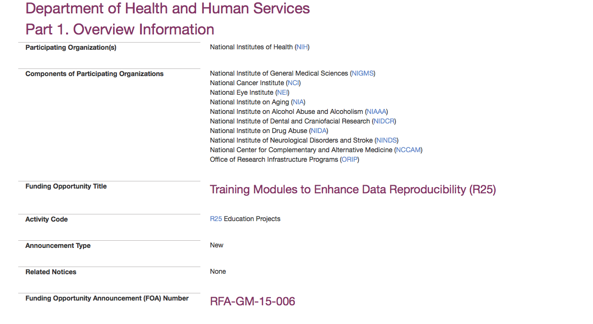
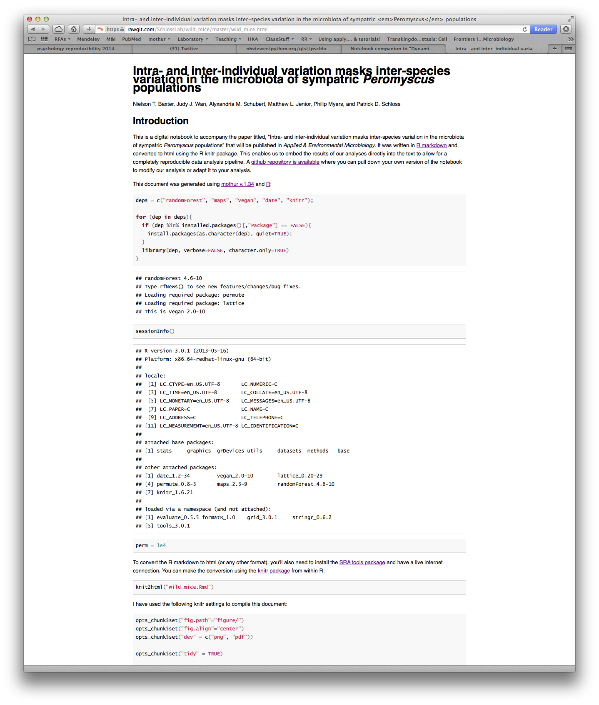

## [Elements of the scientific method (according to wikipedia)](http://en.wikipedia.org/wiki/Scientific_method#Elements_of_the_scientific_method)
* Characterizations
* Hypothesis development
* Predictions from the hypothesis
* Experiments
* Evaluation and improvement
* Confirmation

---

## Evaluation and improvement
> * PIs take it on faith that your analysis is right  
> * Few (any?) reviewers actually try to redo your science on any level  
> * Reproducibility is a critical component to doing science  
> * A flawed experiment can screw over a bunch of downstream studies  

---

## Many levels of reproducibility
> * Repeat the general experiment with a different population  
> * Repeat the general experiment with the same population  
> * Repeat the analysis using the same data  
> * Repeat the analysis using the same data and methods  

---

## For a microbiome study, I should be able to read your paper and...  

1. Download your raw, unprocessed data   
2. Read your paper and any supplements to understand what exactly you did to curate the data  
3. Repeat your analysis  
4. Support your results  
5. Do something creative that builds upon what you've done  

---

## Notes

> * This is not about whether ***you*** ....
  * ... did the analysis correctly
  * ... got the "right" answer
> * It is about whether ***I***...
  * ... am able to see what you did and repeat it
  * ... can use your data to do something more
> * Most importantly, this is not about fraud

---

## General trend: Drug discovery


# Bayer HealthCare
# Prinz et al. 2011. Believe it or not: how much can we rely on published data on potential drug targets? Nature Reviews Drug Discovery 10:712 (http://www.nature.com/nrd/journal/v10/n9/full/nrd3439-c1.html)

---

## General trend: Drug discovery

* Researchers from Amgen replicated 53 "landmark" papers and could only confirm 6 (11%) of the findings  
  - C. Glenn Begley	& Lee M. Ellis. 2012. Drug development: Raise standards for preclinical cancer research. Nature. 483:531.

* "An unspoken rule among early-stage venture capital firms that “at least 50% of published studies, even those in top-tier academic journals, can't be repeated with the same conclusions by an industrial lab” has been recently reported (see Further information) and discussed"
  - Prinz et al. 

---

## General trend: Psychology

* [Reproducibility Project](https://osf.io/ezcuj/wiki/home/)
* Some journals are encouraging authors to submit papers attempting to replicate studies
  * Journal of Experimental Psychology: General
  * Journal of Personality and Social Psychology
  * Psychology of Aesthetics, Creativity, and the Arts
* Controversial

---

## Collins/Tabak: Causes of problem (quotes)

* ***Increased emphasis on making provocative statements rather than presenting technical details***
* Poor training of researchers in experimental design
* Publications that do not report basic elements of experimental design
* Few venues for researchers to publish negative data or papers that point out scientific flaws in previously published work.
* Difficulty of accessing unpublished data — and the failure of funding agencies to establish or enforce policies that insist on data access.

---

## Collins/Tabak: Solutions to the problem (quotes)

* NIH is developing a training module on enhancing reproducibility and transparency of research findings, with an emphasis on good experimental design.
* Several of the NIH's institutes and centres are also testing the use of a checklist to ensure a more systematic evaluation of grant applications.
* Perhaps the most vexed issue is the academic incentive system. It currently over-emphasizes publishing in high-profile journals  

> * Meh.

--- &vcenter



---

## Wommack/Ravel: Does our field have a problem?

* We feel the time is right for the community to set standards for complete transparency and full reproducibility
* Simply providing scripts and workflow is not enough; data and code have to be understandable to be reproducible
* It is no mistake that the best documented tools often turn out to be more frequently used by microbiome researchers

--- &vcenter


---

## I want to replicate this study...

* Validation
  * Spirochetes in the gut(!)
  * Differences between Hadza and Europeans
  * Jeff Leach study
* Ask further questions
  * Are Hadza more similar to US population than to Europeans?
  * Are the Hadza gut spirochaetes the same as their oral spirochaetes?

---

## Possible hurdles: Where to get the data?

* In 15 min we figured out...
  * Not in SRA
  * Some data in MG-RAST, but not all
  * Limited to no metadata
  * Email to PI got very tense response
* The SRA is a pain in the ass and would solve some of these problems

---

## Possible hurdles: How were the data analyzed?

* Limited methods description:  
  - "Sequencing reads were analysed using the QIIME pipeline as described previously"  
  - "Analysis of 454 Pyrosequencing data was done using mothur (version 1.25.1). Briefly, instructions from standard operating procedure (SOP) at the website were followed to process Pyrosequencing data."

* We don't have a culture of adequately documenting our analytical methods
* Over use of GUI and web-driven tools

---

## After a lot of work...

> * Could we replicate their analysis?
>   * No.
> * Why?
>   * No idea.

---

## Now what?

* Contact PI, see what we missed
* Note that we didn't even try to do the analysis ***correctly***!

---

## Is this an isolated incident?
* How accessible are the raw data?
* Is reproducibility dependent on the person trying to reproduce the effort?

---

## What should the goal be?
* Not this!
  * Should ***not*** have to contact the original scientists for help (what happens in 5 years?)
  * Should ***not*** have to distrust original scientists
* `write.paper`
* Note...
  * Anytime you edit a file, you lose reproducibility
  * Anytime you make a decision that is not documented, you lose reproducibility

---

## Literate programming...

* "I believe that the time is ripe for significantly better documentation of programs, and that we can best achieve this by considering programs to be works of literature. Hence, my title: 'Literate Programming.' - Donald Knuth, 1992
* The concept of combining code with documentation

> * `write.paper`

---

## Reproducibile research toolbox 

* Literate programming tools
  - Wikis
  - IPython notebook
  - `knitr` and `slidify` R packages
* Version control: github
* `make`

--- &twocol

## IPython Notebook

*** {name: left}
* An executable wiki
* Can run any programming language (including mothur)
* Can output to any format
* Used for [Ding and Schloss (2014) Nature paper](http://nbviewer.ipython.org/gist/pschloss/9815766/notebook.ipynb)


*** {name: right}


---

## knitr R package

* Very similar to IPython
* Bonus of being able to present varaiables within the text:

```{r, echo=T, eval=T}
random.numbers <- runif(10)
total <- sum(random.numbers)
```

* I randomly drew 10 random numbers. These included: `r random.numbers`
* Their sum was `r total`

---

## slidify R package

```{r 3dplot, webgl=TRUE, echo=FALSE, eval=TRUE, fig.align="center"}
pcoa <- read.table(file="assets/data/stability.axes", header=T, row.names=1)
pcoa <- pcoa[,1:2]
colnames(pcoa) <- c("Axis 1", "Axis 2")

period <- character()
period[as.numeric(gsub(".*D(\\d*)", "\\1", rownames(pcoa))) <= 10] <- "red"
period[as.numeric(gsub(".*D(\\d*)", "\\1", rownames(pcoa))) > 10] <- "blue"
plot(pcoa, pch=19, col=period)
```

--- &twocol

## `write.paper`

*** {name: left}
* Can write a paper in knitr using a combination of `markdown`, `bash`, `R`, `Python`, whatever.
* People have written entire books (what do you think their errata look like?)
* We used this in a paper recently accepted to AEM. 
* Pulls all files from SRA and produces Results section of the paper


*** {name: right}


--- &twocol

## Git/GitHub: Version control software (VCS)

*** {name: left}
* A "time machine" of versions of text and software
* Facilitates collaboration
 * In a collaborative setting you can see who changed what
 * Allows for simultaneous editing

*** {name: right}
  

---

## Git/GitHub: Version control software (VCS)
* Academic users can have free, private repositories
* Anyone you give permissions to can access the repository, enabling them to...
  * Review your code
  * Copy your code
  * Make suggestions to your code
* When you are ready to publish you can make the repository public
* This talk is on GitHub!

---

## Case study: Leslie et al.

* https://github.com/swhitefi
* https://rawgit.com/swhitefi/project1/master/README.html

---

## Philosophy change

* "The term [reproducible research](http://en.wikipedia.org/wiki/Reproducibility) refers to the idea that the ultimate product of academic research is the paper along with the full computational environment used to produce the results in the paper such as the code, data, etc. that can be used to reproduce the results and create new work based on the research." - Wikipedia
* "Your best collaborator is you 6 months from now"

---

## What to do next

* Software
  * Uninstall Prism/Excel
  * [github](http://github.com) account
  * [RStudio](http://www.rstudio.com)
  * [knitr tutorials](http://yihui.name/knitr/demo/showcase/)
* 

